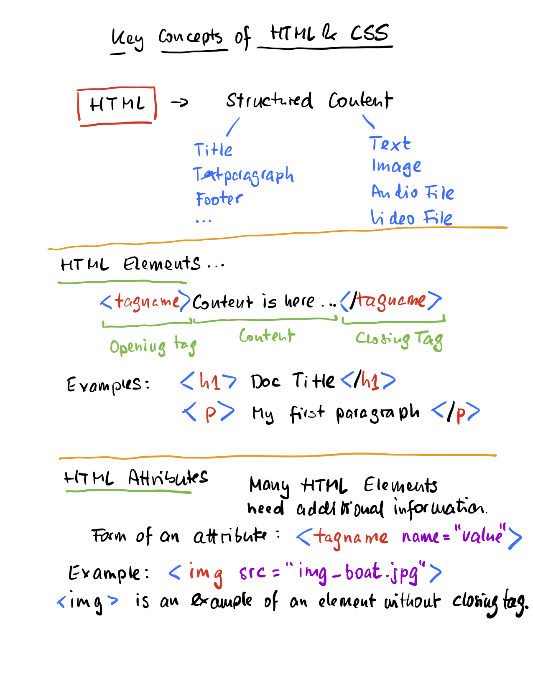
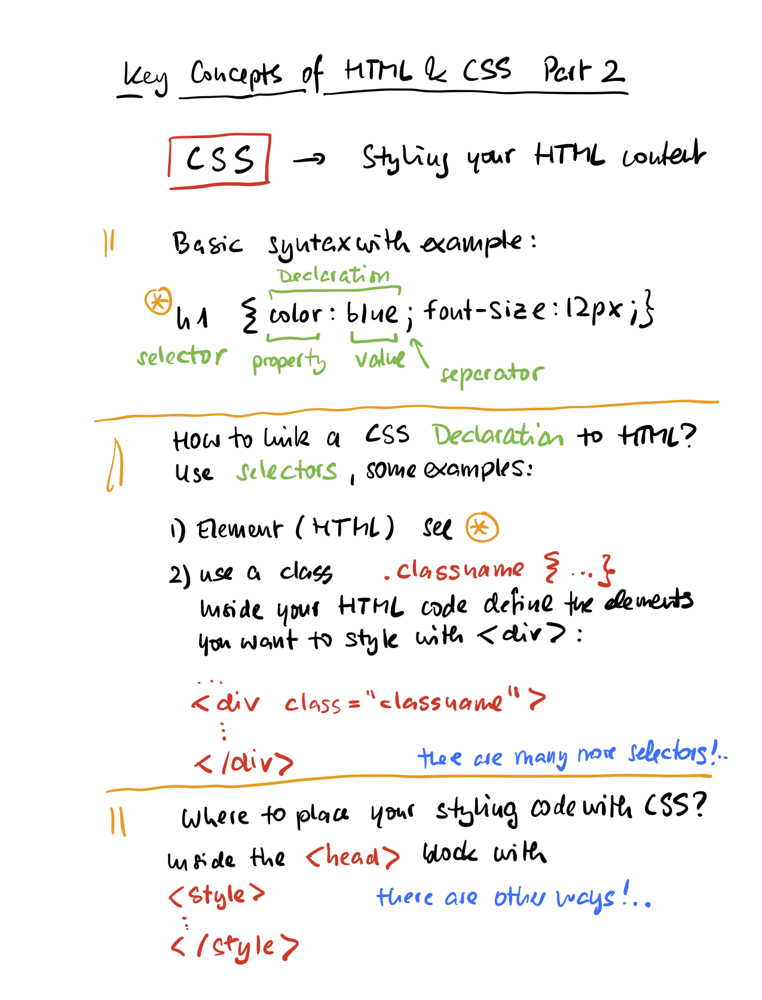

# Overview about HTML and CSS

This repository contains materials I use in my Creative Coding class for the module about HTML and CSS


This unit gives you an idea about the important concepts of HTML and CSS.

You will learn ...
- the basic concepts and terms, of HTML and CSS, and how these two languages are linked with each other.
- to know a few basic HTML elements, CSS commands and declarations
- to modify and add code to code snippets while solving small exercises
- to edit your code using different editors and environments.

## HTML



### What you should do:
- [ ] Go to [w3schools](w3schools.com), open the HTML section and learn about at least 5 different elements and how to use them.
- [ ] On that website, use the online editor and modify or create your own HTML code using those 5 different elements.
- [ ] Copy and paste the code on your own computer, pay attention to name your file with the extension ```.html```. When you are working on a Mac, you will also need to change some settings in the TextEdit editor, please have a look [here](https://www.w3schools.com/html/html_editors.asp). You can show your HTML file on your browser by double clicking on the file.
- [ ] See how to show an image on your website [here](https://www.w3schools.com/tags/tag_img.asp).
- [ ] The repository here contains an audio file. Download the audio .mp3 file or another one of your choice to your computer. See [here](https://www.w3schools.com/html/html5_audio.asp) for the HTML code required to play the audio file from within your website. You can also use the code snippet below and substitute the name of the audio file as needed. You need to copy the audio file into the same folder as your HTML file.
  
``` language=html
<div>
  <audio controls>
    <source src="220516Rec1.mp3" type="audio/mpeg">
  </audio>
</div>
```

- [ ] Include a Youtube video to your webpage. Use the code snippets Youtube provide under the Share section below the video. You can find details on the HTML code [here](https://www.w3schools.com/html/html_youtube.asp).


## CSS



### What you should do:
- [ ] Get to know the property [color](https://www.w3schools.com/css/css_colors.asp)
- [ ] Get to know the [CSS Box Model](https://www.w3schools.com/css/css_colors.asp)
- [ ] Learn about some ways to format [text](https://www.w3schools.com/css/css_text.asp) with CSS.
- [ ] Apply those properties to the HTML code that you have written so far. If necessary, add more HTML elements. 

## More things to learn about

Once you have a basic familiarity with HTML and CSS, you can dive deeper. 

- [ ] How to use [Emojis](https://www.w3schools.com/html/html_emojis.asp) on a website?
- [ ] See how to create a basic layout with HTML [HTML Layout Elements and Techniques](https://www.w3schools.com/html/html_layout.asp)
- [ ] Try to integrate varous media into your website (see above YouTube, Audio, Video)
